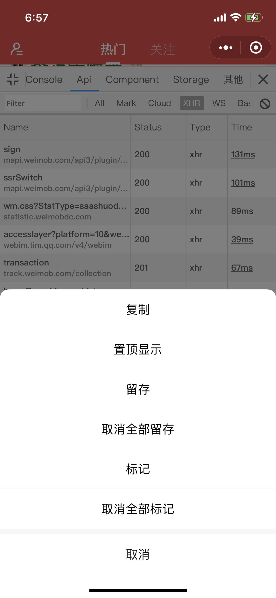
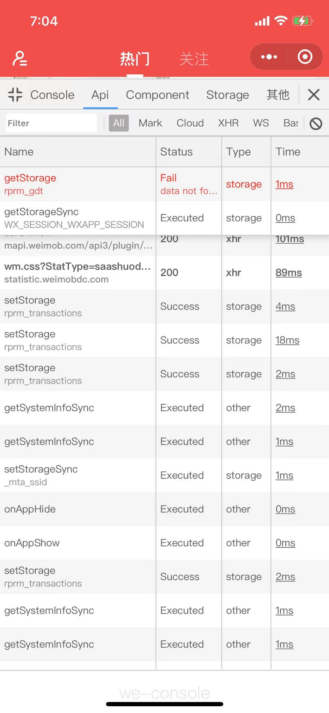
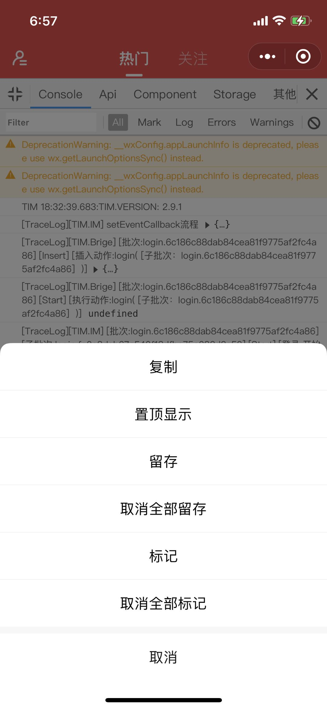
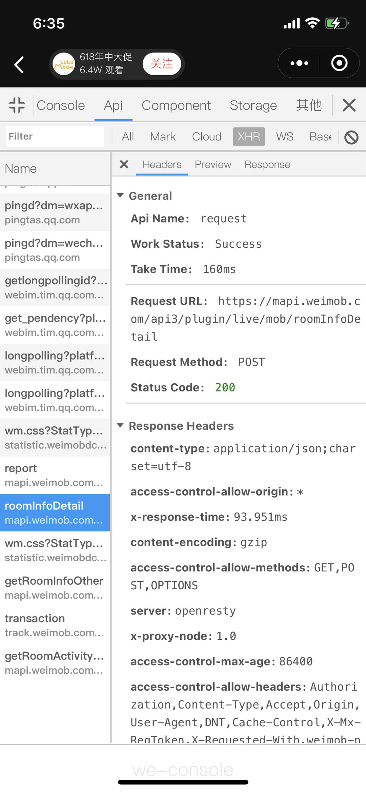
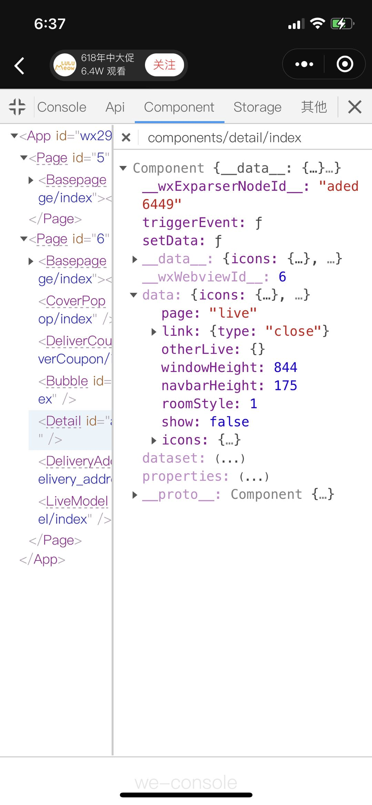
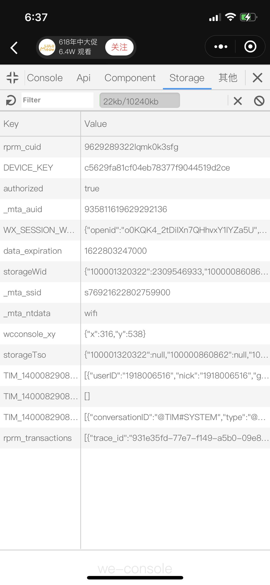
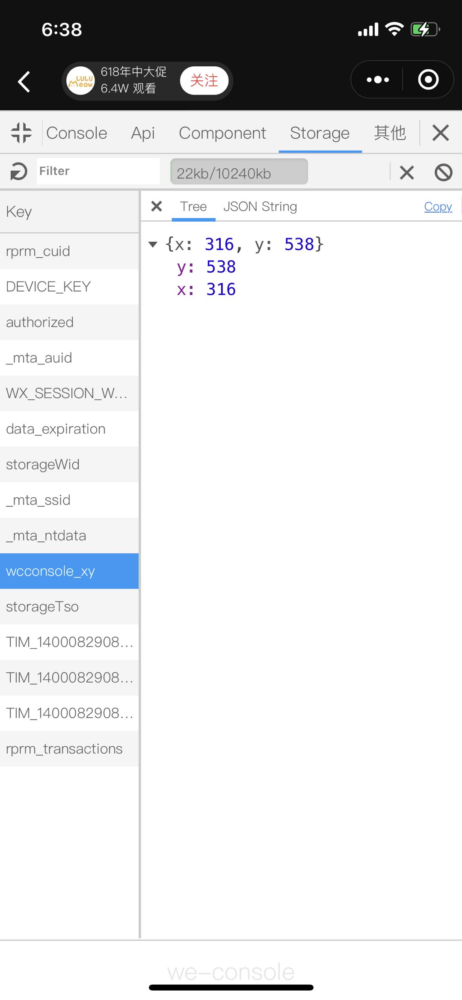
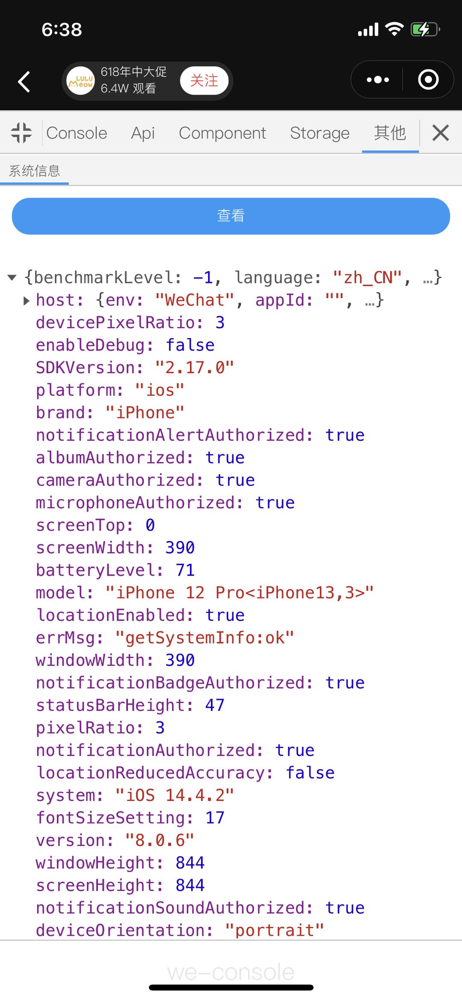
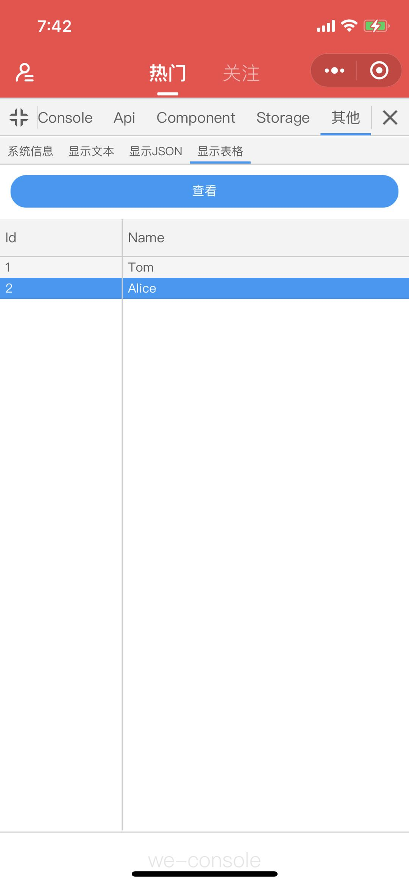

# WeConsole——功能全面、界面与体验对标 Chrome devtools 的可定制化的跨平台小程序开发调试面板

[](https://www.npmjs.com/package/weconsole)
[](https://www.npmjs.com/package/weconsole)
[](https://www.npmjs.com/package/weconsole)
[](https://standardjs.com)


# 更新记录

-   v1.4.0

    -   功能升级
        -   支持跨平台：目前已支持`微信`、`支付宝`，后续还将支持百度、小红书、QQ 等小程序平台
        -   优化虚拟列表
        -   优化`Console`面板
            -   优化样式
        -   优化`Api`面板
            -   切换分类时重置详细页
            -   优化样式
        -   优化`Component`面板
            -   显示`<App>`环境版本和版本号
        -   提供`cli`工具方便向小程序项目一键注入 weconsole 代码
    -   修复 BUG
        -   修复`Api`面板切换详情时 json 数据未变的问题
        -   修复`Console`面板复制对象存在循环引用情况下无法复制并报错的问题
    -   重构代码
        -   自定义`CustomAction`组件对接`table`组件
        -   抽象跨平台代码到独立 npm 包
    -   其他
        -   添加`支付宝`小程序示例代码

-   v1.3.0

    -   功能升级
        -   更换虚拟列表底层实现
        -   优化部分`api`列表项标题文案
        -   优化自定义`action`展示
    -   修复 BUG
        -   修复虚拟列表滚动白屏问题
        -   修复`storage`复制失败问题
        -   修复复制`console`等数据存在循环引用时报错的问题
    -   重构代码
        -   删除`data-grid`组件改用底层使用虚拟列表的`table`组件
        -   删除无用 mixin
    -   编译优化
        -   优化主包分包代码分块
    -   其他
        -   添加小程序示例代码，目录：`examples`

-   v1.2.0

    -   重构代码
        -   使用`class`方式定义组件
    -   编译优化
        -   初步划分主包和分包目录
        -   JS 产物文件合并

-   v1.1.3
    -   升级依赖包
    -   优化性能
        -   组件/页面实例销毁后也从 weconsole 缓存中删除
        -   点击`console/api`的清除按钮后，也将缓存中的数据删除
        -   优化数据存储方式
        -   组件`setData`使用延迟更新方式
    -   修复 BUG
        -   `data-grid`组件列宽度计算错误问题
        -   `自定义action`不显示按钮文案的问题
    -   添加功能
        -   `自定义 data-grid action`支持长按复制单元格内容
        -   `data-grid`组件支持多行文本

# 一、背景与简介

在传统的 PC Web 前端开发中，浏览器为开发者提供了体验良好、功能丰富且强大的开发调试工具，比如常见的 Chrome devtools 等，这些调试工具极大的方便了开发者，它们普遍提供查看页面结构、监听网络请求、管理本地数据存储、debugger 代码、使用 Console 快速显示数据等功能。

但是在近几年兴起的微信小程序的前端开发中，却少有类似的体验和功能对标的开发调试工具出现。当然微信小程序的官方也提供了类似的工具，那就是 vConsole，但是相比 PC 端提供的工具来说确实无论是功能和体验都有所欠缺，所以我们开发了 weconsole 来提供更加全面的功能和更好的体验。

基于上述背景，我们（**起初**）想开发一款运行在微信小程序环境上（**目前可运行与多个小程序平台**），无论在用户体验还是功能等方面都能媲美 PC 端的前端开发调试工具，当然某些（如 debugger 代码等）受限于技术在当前时期无法实现的功能我们暂且忽略。

我们将这款工具命名为`Weimob Console`，简写为`WeConsole`。

</img>

# 二、安装与使用

## 1、通过 npm 安装

```bash
npm i weconsole -S
```

## 2、普通方式安装

> 此方式会将`WeConsole`依赖的所有 npm 代码包都自动引入，无需再通过开发者工具进行 npm 编译。

可将 npm 包下载到本地，然后：

-   `微信小程序`：请将`dist/full`目录中的文件拷贝至项目目录中；
-   `支付宝小程序`：请将`dist/alipay/full`目录中的文件拷贝至项目目录中；

## 3、引用

WeConsole 分为`核心`和`组件`两部分，使用时需要全部引用后方可使用：

-   `核心`负责重写系统变量或方法，以达到全局监控的目的；
-   `组件`负责将监控的数据显示出来。

### 3.1 在`app.js`文件中引用`核心`：

-   `微信小程序`引用方式：

```javascript
// NPM方式引用
import 'weconsole/main/init';

// 普通方式引用
import '{复制后的【dist/full】的路径}/main/init';
```

-   `支付宝小程序`引用方式：

```javascript
// NPM方式引用
import 'weconsole/dist/alipay/npm/main/init';

// 普通方式引用
import '{复制后的【dist/alipay/full】的路径}/main/init';
```

引入`main/init`后，就是默认将 App、Page、Component、Api、Console 全部重写监控！如果想按需重写，可以使用如下方式进行：

```javascript
import { replace, restore, showWeConsole, hideWeConsole } from '{NPM或复制后的【dist/full】的路径}/main/index';

// scope可选值：App/Page/Component/Console/Api
// 按需替换系统变量或函数以达到监控
replace(scope);

// 可还原
restore(scope);

// 通过show/hide方法控制显示入口图标
showWeConsole();
```

> 如果没有显式调用过`showWeConsole/hideWeConsole`方法，组件第一次初始化时，会根据根据小程序当前状态综合判断入口图标的显示性，这些规则包括：

-   当`调试模式开启`时，显示
-   当处于`开发者工具环境`时，显示
-   当处于`预览版`时，显示
-   当处于`体验版`时，显示
-   当处于`正式版`时，**不显示**

### 3.2 在需要的地方引用`组件`：

-   `微信小程序`引用方式：

```javascript
// NPM方式引用
"usingComponents": {
    "weconsole": "weconsole/subpackage/components/main/index"
}

// 普通方式引用
"usingComponents": {
    "weconsole": "{复制后的【dist/full】的路径}/subpackage/components/main/index"
}
```

-   `支付宝小程序`引用方式：

```javascript
// NPM方式引用
"usingComponents": {
    "weconsole": "weconsole/dist/my/npm/subpackage/components/main/index"
}

// 普通方式引用
"usingComponents": {
    "weconsole": "{复制后的【dist/alipay/full】的路径}/subpackage/components/main/index"
}
```

然后在小程序视图层的`xml`文件中使用`<weconsole>`标签进行初始化：

> 可以使用 weconsole 提供的命令行工具一键批量插入标签，参考 **【5、一键注入】**

```xml
<!-- page/component.wxml -->
<weconsole />
```

`<weconsole>`标签支持传入以下属性：

```javascript
properties: {
    // 组件全屏化后，距离窗口顶部距离
    fullTop: String,
    // 刘海屏机型（如iphone12等）下组件全屏化后，距离窗口顶部距离
    adapFullTop: String,
    // v1.1.0 支持，代表weconsole组件的z-index值
    zIndex: Number,
    // v1.1.0 支持，自定义weconsole图标，传递图片URL
    icon: String,
    // v1.1.0 支持，支持自定义图标样式，传true时同时设置slot="hand"的插槽内容，可定制
    customHand: Boolean
}
```

## 4、建议

如果不想将 weconsole 放置在主包中，建议将组件放在分包内使用，利用小程序的 [分包异步化](https://developers.weixin.qq.com/miniprogram/dev/framework/subpackages/async.html) 的特性，减少主包大小；

-   微信小程序：
    -   主包文件：`dist/{full|npm}/main/*`
    -   分包文件：`dist/{full|npm}/subpackage/*`
-   支付宝小程序：
    -   主包文件：`dist/alipay/{full|npm}/main/*`
    -   分包文件：`dist/alipay/{full|npm}/subpackage/*`

## 5、一键注入

如果你不想一个个页面的插入`<weconsole>`标签，或者就想小程序中的所有页面全部插入，那你可以使用 weconsole 提供的命令行工具来完成：

```bash
# 安装weconsole后，可使用`weconsole inject`命令进行一键注入

npx weconsole inject ./my-mp-xxx copy replace
```

`weconsole`命令可接受的参数及可选值含义如下：

```ts
interface InjectConfig {
    /** 要注入的小程序项目目录 */
    projectDir: string;
    /** 如果项目已经被注入过了，是否本次注入要进行替换？ */
    replace?: boolean;
    /** 本次注入强行显示weconsole入口图标 */
    forceShow?: boolean;
    /** 注入方式：
     * npm: 以引用npm包的方式注入，但注入后需要开发者工具主动编译才可使用，好处是如果有重复的依赖可以减少代码体积；
     * full: 以全依赖引用的方式注入，无需开发者工具主动编译就可使用，缺点是可能存在依赖包被重复打包代码的问题；
     */
    mode?: 'npm' | 'full';
    /** 注入的小程序项目属于哪个平台？ */
    platform?: 'wx' | 'alipay';
    /** 注入weconsole标签时传入的fullTop属性值 */
    fullTop?: string;
    /** 注入weconsole标签时传入的adapFullTop属性值 */
    adapFullTop?: string;
    /** 注入weconsole标签时传入的zIndex属性值 */
    zIndex?: number;
    /** 是否在注入时将weconsole的所有JS及组件文件复制到项目根目录？ */
    copy?: boolean;
}
```

# 三、功能

<details>
<summary>WeConsole 主要包括以下功能：</summary>

## 1、Console

-   界面如图 1
-   实时显示`console.log/info/warn/error`记录；
-   `Filter`框输入关键字已进行记录筛选；
-   使用分类标签`All, Mark, Log, Errors, Warnings...`等进行记录分类显示，分类列表中`All, Mark, Log, Errors, Warnings`为固定项，其他可由配置项`consoleCategoryGetter`产生
-   点击`🚫`按钮清空记录（不会清除`留存`的记录）
-   `长按`记录可弹出操作项（如图 2）：
    -   `复制`：将记录数据执行复制操作，具体形式可使用配置项`copyPolicy`指定，未指定时，将使用`JSON.stringify`序列化数据，将其复制到剪切板
    -   `取消置顶/置顶显示`：将记录取消置顶/置顶显示，最多可置顶三条（置顶无非是想快速找到重要的数据，当重要的数据过多时，就不宜用置顶了，可以使用`标记`功能，然后在使用筛选栏中的`Mark`分类进行筛选显示）
    -   `取消留存/留存`：留存是指将记录保留下来，使其不受清除，即点击`🚫`按钮不被清除
    -   `取消全部留存`：取消所有留存的记录
    -   `取消标记/标记`：标记就是将数据添加一个`Mark`的分类，可以通过筛选栏快速分类显示
    -   `取消全部标记`：取消所有标记的记录

<!--  -->

</img>

图 1

<!--  -->

</img>

图 2

## 2、Api

-   界面如图 3
-   实时显示`wx`对象下的相关 api 执行记录
-   `Filter`框输入关键字已进行记录筛选
-   使用分类标签`All, Mark, Cloud, xhr...`等进行记录分类显示，分类列表由配置项`apiCategoryList`与`apiCategoryGetter`产生
-   点击`🚫`按钮清空记录（不会清除`留存`的记录）
-   `长按`记录可弹出操作项（如图 4）：
    -   `复制`：将记录数据执行复制操作，具体形式可使用配置项`copyPolicy`置顶，未指定时，将使用系统默认方式序列化数据（具体看实际效果），将其复制到剪切板
    -   其他操作项含义与`Console`功能类似
-   点击条目可展示详情，如图 5

<!--  -->

</img>

图 3

<!--  -->

</img>

图 4

<!--  -->

</img>

图 5

## 3、Component

-   界面如图 6
-   树结构显示组件实例列表
    -   根是`App`
    -   二级固定为`getCurrentPages`返回的页面实例
    -   三级及更深通过`this.selectOwnerComponent()`进行父实例定位，进而确定层级
-   点击节点名称（带有下划虚线），可显示组件实例详情，以 JSON 树的方式查看组件的所有数据，如图 7

<!--  -->

</img>

图 6

<!--  -->

</img>

图 7

## 4、Storage

-   界面如图 8
-   显示 Storage 记录
-   `Filter`框输入关键字已进行记录筛选
-   点击`🚫`按钮清空记录（不会清除`留存`的记录）
-   `长按`操作项含义与`Console`功能类似
-   点击条目后，再点击`❌`按钮可将其删除
-   点击`Filter`框左侧的`刷新`按钮可刷新全部数据
-   点击条目显示详情，如图 9

<!--  -->

</img>

图 8

<!--  -->

</img>

图 9

## 5、其他

-   界面如图 10
-   默认显示 系统信息
-   可通过`customActions`配置项进行界面功能快速定制，也可通过`addCustomAction/removeCustomAction`添加/删除定制项目
-   几个简单的定制案例如下，效果如图 11：

```javascript
import { setUIRunConfig } from 'xxx/weconsole/main/index.js';

setUIRunConfig({
    customActions: [
        {
            id: 'test1',
            title: '显示文本',
            autoCase: 'show',
            cases: [
                {
                    id: 'show',
                    button: '查看',
                    showMode: WcCustomActionShowMode.text,
                    handler(): string {
                        return '测试文本';
                    }
                },
                {
                    id: 'show2',
                    button: '查看2',
                    showMode: WcCustomActionShowMode.text,
                    handler(): string {
                        return '测试文本2';
                    }
                }
            ]
        },
        {
            id: 'test2',
            title: '显示JSON',
            autoCase: 'show',
            cases: [
                {
                    id: 'show',
                    button: '查看',
                    showMode: WcCustomActionShowMode.json,
                    handler() {
                        return wx;
                    }
                }
            ]
        },
        {
            id: 'test3',
            title: '显示表格',
            autoCase: 'show',
            cases: [
                {
                    id: 'show',
                    button: '查看',
                    showMode: WcCustomActionShowMode.grid,
                    handler(): WcCustomActionGrid {
                        return {
                            cols: [
                                {
                                    title: 'Id',
                                    field: 'id',
                                    width: 30
                                },
                                {
                                    title: 'Name',
                                    field: 'name',
                                    width: 70
                                }
                            ],
                            data: [
                                {
                                    id: 1,
                                    name: 'Tom'
                                },
                                {
                                    id: 2,
                                    name: 'Alice'
                                }
                            ]
                        };
                    }
                }
            ]
        }
    ]
});
```

<!--  -->

</img>

图 10

<!--  -->

</img>

图 10

</details>

# 四、API

<details>
<summary>主要暴露以下API：</summary>

## 通过以下方式使用 API

```javascript
import { showWeConsole, ... } from 'weconsole';
showWeConsole();
```

## replace(scope:'App'|'Page'|'Component'|'Api'|'Console')

替换系统变量或函数以达到监控，底层控制全局仅替换一次

## restore(scope:'App'|'Page'|'Component'|'Api'|'Console')

还原被替换的系统变量或函数，还原后界面将不在显示相关数据

## showWeConsole()

显示`WeConsole`入口图标

## hideWeConsole()

隐藏`WeConsole`入口图标

## setUIConfig(config: Partial&lt;MpUIConfig&gt;)

设置`WeConsole`组件内的相关配置，可接受的配置项及含义如下：

```typescript
interface MpUIConfig {
    /** 监控小程序API数据后，使用该选项进行该数据的分类值计算，计算后的结果显示在界面上 */
    apiCategoryGetter?: MpProductCategoryMap | MpProductCategoryGetter;
    /** 监控Console数据后，使用该选项进行该数据的分类值计算，计算后的结果显示在界面上 */
    consoleCategoryGetter?: MpProductCategoryMap | MpProductCategoryGetter;
    /** Other内置信息中获取当前页面实例时执行的方法 */
    currentPageGetter?: () => MpView;
    /** API选项卡下显示的数据分类列表，all、mark、other 分类固定存在 */
    apiCategoryList?: Array<string | MpNameValue<string>>;
    /** 复制策略，传入复制数据，可通过数据的type字段判断数据哪种类型，比如api/console */
    copyPolicy?: MpProductCopyPolicy;
    /** 定制化列表 */
    customActions?: WcCustomAction[];
    /** 默认的api分类值 */
    apiDefaultCategoryValue?: string;
    /** 默认的console分类值 */
    consoleDefaultCategoryValue?: string;
    /** 不监控这些API，也就是说这些API调用后不会在【API】选项卡中显示 */
    ignoreHookApiNames?: string[];
    /** 只监控这些API，也就是除了这些API以外的其他调用都不会在【API】选项卡中显示 */
    onlyHookApiNames?: string[];
    /** 全局对象，如果你的小程序存在沙盒环境，请务必传递一个可供全局存储数据的单例对象 */
    globalObject?: any;
}

// 配置项的详细types请参考源码目录：src/types
```

## addCustomAction(action: WcCustomAction)

添加一个定制化项目；当你添加的项目中需要显示你自己的组件时：

-   请将 case 的`showMode`值设置为`component`
-   在`app.json`中注册名称为`weconsole-customer`的组件
-   定制化项目的 case 被执行时，会将执行结果传递给`weconsole-customer`的`data`属性
-   开发者根据`data`属性中的数据自行判断内部显示逻辑

## removeCustomAction(actionId: string)

根据 ID 删除一个定制化项目

## getWcControlMpViewInstances():any[]

获取小程序内 weconsole 已经监控到的所有的 App/Page/Component 实例

## log(type = "log", ...args)

因为 console 被重写，当你想使用最原始的 console 方法时，可以通过该方式，type 就是 console 的方法名

## on/once/off/emit

提供一个事件总线功能，全局事件及相关函数定义如下：

```typescript
const enum WeConsoleEvents {
    /**UIConfig对象发生变化时 */
    WcUIConfigChange = 'WcUIConfigChange',
    /**入口图标显示性发生变化时 */
    WcVisableChange = 'WcVisableChange',
    /**CanvasContext准备好时，CanvasContext用于JSON树组件的界面文字宽度计算 */
    WcCanvasContextReady = 'WcCanvasContextReady',
    /**CanvasContext销毁时 */
    WcCanvasContextDestory = 'WcCanvasContextDestory',
    /**主组件的宽高发生变化时 */
    WcMainComponentSizeChange = 'WcMainComponentSizeChange'
}

interface IEventEmitter<T = any> {
    on(type: string, handler: EventHandler<T>);
    once(type: string, handler: EventHandler<T>);
    off(type: string, handler?: EventHandler<T>);
    emit(type: string, data?: T);
}
```

</details>

# 五、后续规划

-   [x] 优化包大小
-   [x] 体验优化
-   [x] 定制化升级
-   [x] 支持其他小程序平台（支付宝/百度/字节跳动）
-   [-] 单元测试
-   [-] 基于网络通信的界面化 weconsole
-   [-] 标准化
-   [-] 支持 H5

# 六、贡献流程

请阅读 [贡献流程](./CONTRIBUTING.md) 文档来参与项目的迭代与开发，我们将会非常感谢您的付出。

# 七、License

WeConsole 使用 [MIT](./LICENSE) 协议.

# 八、声明

生产环境请谨慎使用。
